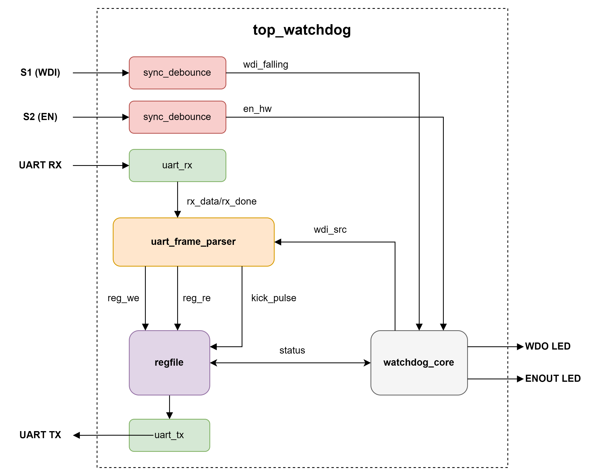
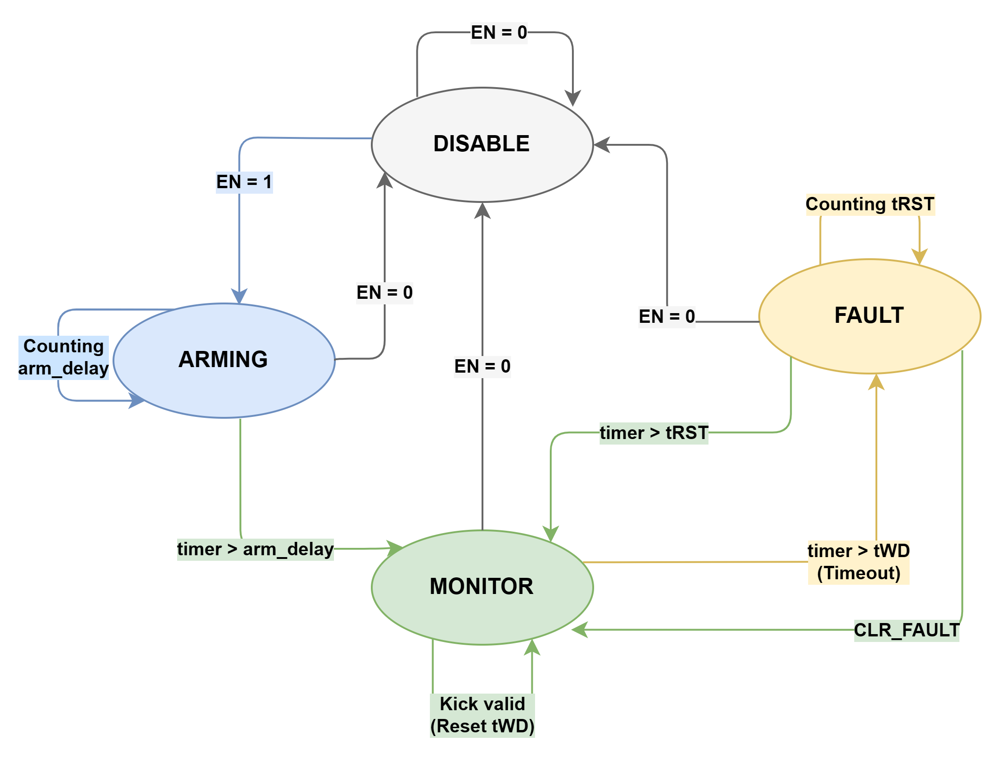
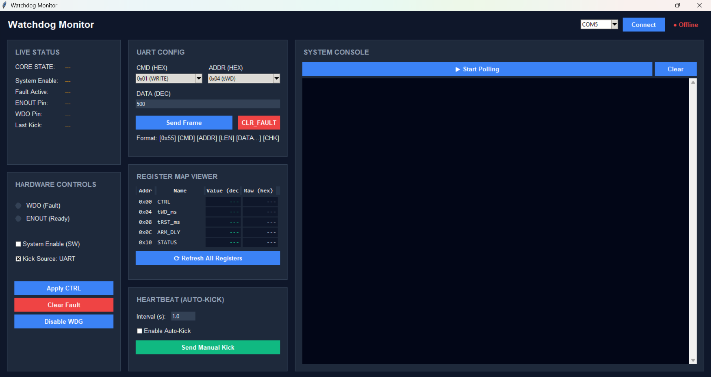

# Watchdog Monitor System — Kiwi 1P5 FPGA

> **FPGA-based Watchdog Timer** emulating the **TPS3431** IC behavior on the **Gowin GW1N-UV1P5** (Kiwi 1P5 board).  
> Fully configurable via UART from a host PC with a custom binary protocol.

---

## Table of Contents

- [Overview](#overview)
- [Architecture](#architecture)
- [Pin Mapping](#pin-mapping)
- [UART Protocol](#uart-protocol)
- [Register Map](#register-map)
- [FSM State Machine](#fsm-state-machine)
- [Module Reference](#module-reference)
  - [top_watchdog](#1-top_watchdogv--top-level)
  - [sync_debounce](#2-sync_debouncevx2--button-input-conditioning)
  - [uart_rx](#3-uart_rxv--uart-receiver)
  - [uart_tx](#4-uart_txv--uart-transmitter)
  - [uart_frame_parser](#5-uart_frame_parserv--protocol-engine)
  - [regfile](#6-regfilev--register-file)
  - [watchdog_core](#7-watchdog_corev--fsm--timers)
- [Testbenches](#testbenches)
- [Hardware Test Tool](#hardware-test-tool)
- [Watchdog GUI](#watchdog-gui)
- [Build & Deploy](#build--deploy)

---

## Overview

| Parameter | Value |
|---|---|
| **FPGA** | Gowin GW1N-UV1QN48 (Kiwi 1P5) |
| **System Clock** | 27 MHz |
| **UART** | 115200 baud, 8N1 |
| **Language** | Verilog-2001 |
| **Toolchain** | Gowin EDA (GOWIN FPGA Designer) |
| **Reset** | Internal Power-On Reset (255 clock cycles) |

### What It Does

This system monitors a downstream processor or subsystem. If the monitored system fails to send periodic **"kick" pulses** within a configurable timeout window (`tWD`), the watchdog asserts a fault output (`WDO` → LOW), signaling a system failure. After a configurable holding period (`tRST`), the watchdog automatically recovers.

### Key Features

- **Dual Enable Source**: Hardware button (S2) OR software register (`CTRL[0]`)
- **Dual Kick Source**: Hardware button (S1) OR UART command (`CMD 0x03`), selected by `CTRL[1]`
- **Configurable Timers**: `tWD`, `tRST`, `arm_delay` — all adjustable at runtime via UART
- **Write-1-to-Clear Fault**: Immediate fault recovery via `CTRL[2]`
- **XOR Checksum Validation**: Corrupted UART frames are silently dropped
- **Prescaler Drift Protection**: All time-base counters reset synchronously on state transitions

---

## Architecture



---

## Pin Mapping

| Signal | Pin | Direction | Description |
|---|---|---|---|
| `clk` | 4 | Input | 27 MHz system clock |
| `wdi_pin` | 35 | Input | S1 Button — WDI Kick (active-low, pull-up) |
| `en_hw_pin` | 36 | Input | S2 Button — Hardware Enable (active-low, pull-up) |
| `uart_rx_pin` | 33 | Input | UART RX from PC |
| `uart_tx_pin` | 34 | Output | UART TX to PC |
| `wdo_pin` | 27 | Output | WDO Fault LED: HIGH=OK, LOW=Fault |
| `enout_pin` | 28 | Output | ENOUT Activity LED: HIGH=Active, LOW=Disabled |

---

## UART Protocol

### Frame Format

All communication uses a fixed binary frame format with **Big-Endian** byte ordering for data fields:

```
┌──────┬─────┬──────┬─────┬──────────────────┬─────┐
│ 0x55 │ CMD │ ADDR │ LEN │ DATA (0-4 bytes) │ CHK │
└──────┴─────┴──────┴─────┴──────────────────┴─────┘
```

| Field | Size | Description |
|---|---|---|
| `0x55` | 1 byte | Start byte (frame sync marker) |
| `CMD` | 1 byte | Command code |
| `ADDR` | 1 byte | Register address |
| `LEN` | 1 byte | Number of DATA bytes (0 or 4) |
| `DATA` | 0–4 bytes | Payload in Big-Endian |
| `CHK` | 1 byte | XOR checksum of `CMD ^ ADDR ^ LEN ^ DATA[0..n]` |

### Commands

| CMD | Name | TX Frame (PC → FPGA) | RX Response (FPGA → PC) |
|---|---|---|---|
| `0x01` | **WRITE** | `55 01 ADDR 04 D3 D2 D1 D0 CHK` | `55 01 ADDR 00 CHK` (ACK) |
| `0x02` | **READ** | `55 02 ADDR 00 CHK` | `55 02 ADDR 04 D3 D2 D1 D0 CHK` |
| `0x03` | **KICK** | `55 03 00 00 03` | `55 03 00 00 03` (ACK) or silent drop |
| `0x04` | **GET_STATUS** | `55 04 00 00 04` | `55 04 10 04 D3 D2 D1 D0 CHK` |

> **Note**: KICK is silently dropped (no ACK) when `CTRL[1]` (WDI_SRC) = 0 (HW-only mode). This prevents the host from receiving a false positive acknowledgment.

### Checksum Validation

Frames with incorrect checksums are **silently ignored**. No error response is sent.

---

## Register Map

| Address | Name | Width | Access | Default | Description |
|---|---|---|---|---|---|
| `0x00` | **CTRL** | 32-bit | R/W + W1C | `0x00000000` | Control register |
| `0x04` | **tWD_ms** | 32-bit | R/W | `1600` | Watchdog timeout (ms) |
| `0x08` | **tRST_ms** | 32-bit | R/W | `200` | Fault holding duration (ms) |
| `0x0C` | **arm_delay_us** | 16-bit | R/W | `150` | Initial arming delay (µs) |
| `0x10` | **STATUS** | 32-bit | R/O | `—` | Live hardware status flags |

### CTRL Register (0x00) — Bit Fields

| Bit | Name | Access | Description |
|---|---|---|---|
| 0 | `en_sw` | R/W | Software enable. `1` = Enable watchdog |
| 1 | `wdi_src` | R/W | Kick source. `0` = HW (S1 button), `1` = SW (UART) |
| 2 | `clr_fault` | W1C | Write `1` to immediately clear fault and release WDO |
| 31:3 | — | — | Reserved (reads as 0) |

### STATUS Register (0x10) — Bit Fields

| Bit | Name | Description |
|---|---|---|
| 0 | `en_effective` | `1` when FSM is in MONITOR or FAULT state |
| 1 | `fault_active` | `1` when FSM is in FAULT state |
| 2 | `enout_state` | Current level of ENOUT pin |
| 3 | `wdo_state` | Current level of WDO pin (`1`=OK, `0`=Fault) |
| 4 | `last_kick_src` | Source of last successful kick (`0`=HW, `1`=SW) |

---

## FSM State Machine



| State | WDO | ENOUT | Timer | Kick Behavior |
|---|---|---|---|---|
| **DISABLE** | HIGH (OK) | LOW | — | All kicks ignored |
| **ARMING** | HIGH (OK) | LOW | Counts `arm_delay_us` | All kicks ignored |
| **MONITOR** | HIGH (OK) | HIGH | Counts `tWD_ms` | Valid kick resets timer |
| **FAULT** | LOW (Fault) | HIGH | Counts `tRST_ms` | All kicks ignored |

### Enable Logic

```
en_combined = en_hw (S2 button inverted) | en_sw (CTRL[0])
```

If `en_combined` goes LOW at **any time**, the FSM immediately returns to DISABLE regardless of current state.

### Kick Source Selection

```
kick_valid = (wdi_src == 0) ? wdi_falling_hw : uart_kick_pulse
```

Only one source is active at a time, determined by `CTRL[1]`.

---

## Module Reference

### 1. `top_watchdog.v` — Top Level

**Purpose**: Integrates all 7 sub-blocks and provides the Power-On Reset generator.

- **Power-On Reset**: An 8-bit counter counts 255 clock cycles (~9.4 µs at 27 MHz) after power-up, then releases `rst_n` HIGH permanently.
- **Active-Low Inversion**: S2 button output is inverted (`en_hw = ~en_hw_debounced`) to convert from active-low hardware to active-high internal logic.
- **Debounce Config**: Both buttons use `DELAY_CYCLES = 540,000` → ~20 ms at 27 MHz.

---

### 2. `sync_debounce.v`(×2) — Button Input Conditioning

**Purpose**: Synchronizes asynchronous button inputs and filters mechanical bounce.

**Three sub-blocks**:
1. **2-FF Synchronizer** (`sync1`, `sync2`): Prevents metastability by passing the asynchronous input through two flip-flops.
2. **Debounce Counter** (`cnt`): If `sync2 ≠ button_o`, increments a 20-bit counter. When it reaches `DELAY_CYCLES - 1`, the output is updated. If the signal bounces back, the counter resets.
3. **Falling Edge Detector** (`button_o_prev`): Generates a single-cycle pulse when `button_o` transitions from 1 → 0. Used for WDI kick detection.

| Parameter | Default | Description |
|---|---|---|
| `DELAY_CYCLES` | 1,000,000 | Debounce duration in clock cycles |

---

### 3. `uart_rx.v` — UART Receiver

**Purpose**: Deserializes the UART RX bitstream into 8-bit parallel data.

**FSM** (4 states):

| State | Action |
|---|---|
| `S_IDLE` | Waits for Start bit (RX line goes LOW) |
| `S_START` | Counts to half-bit period, re-verifies Start bit at the center to reject glitches |
| `S_DATA` | Samples each of 8 data bits at bit-center (full-bit-period spacing) |
| `S_STOP` | Waits one full bit period, then pulses `rx_done_o` HIGH for 1 cycle |

**Key feature**: Includes a 2-FF synchronizer for the RX input to prevent metastability.

| Parameter | Default | Description |
|---|---|---|
| `CLK_FREQ` | 50,000,000 | System clock frequency (Hz) |
| `BAUD_RATE` | 115200 | Target baud rate |

Derived: `CLKS_PER_BIT = CLK_FREQ / BAUD_RATE` (234 at 27 MHz / 115200).

---

### 4. `uart_tx.v` — UART Transmitter

**Purpose**: Serializes 8-bit parallel data into a UART bitstream.

**FSM** (4 states):

| State | Action |
|---|---|
| `S_IDLE` | TX line HIGH, waits for `tx_start_i` pulse |
| `S_START` | Pulls TX LOW for 1 bit period (Start bit) |
| `S_DATA` | Shifts out 8 data bits LSB-first, 1 bit per period |
| `S_STOP` | Pulls TX HIGH for 1 bit period (Stop bit), returns to IDLE |

**Busy flag**: `tx_busy_o` is HIGH during `S_START`, `S_DATA`, and `S_STOP`.

---

### 5. `uart_frame_parser.v` — Protocol Engine

**Purpose**: Implements a 10-state FSM that parses incoming UART frames byte-by-byte, executes commands, and constructs response frames.

**FSM Flow** (3 phases):

#### Phase 1 — RX Frame Parsing
| State | Action |
|---|---|
| `S_WAIT_55` | Waits for Start byte `0x55` |
| `S_CMD` | Captures command byte, initializes XOR checksum |
| `S_ADDR` | Captures address byte, accumulates checksum |
| `S_LEN` | Captures length byte. If `LEN=0`, skips to `S_CHK` |
| `S_DATA` | Captures `LEN` data bytes in Big-Endian using shift: `{wdata[23:0], rx_data}` |
| `S_CHK` | Compares received checksum vs calculated. Match → `S_EXEC`, Mismatch → `S_WAIT_55` |

#### Phase 2 — Command Execution
| State | Action |
|---|---|
| `S_EXEC` | Dispatches based on `cmd_reg`: WRITE (0x01) asserts `reg_we`, READ/STATUS (0x02/0x04) asserts `reg_re`, KICK (0x03) asserts `uart_kick_pulse` if `wdi_src=1` (otherwise silently drops) |
| `S_WAIT_RD` | Waits 1 clock cycle for `reg_rdata_i` to stabilize |

#### Phase 3 — TX Response
| State | Action |
|---|---|
| `S_TX_PREP` | Fills `tx_buf[0..7]` with response frame header + data. Sets `tx_len_total` (5 for ACK, 9 for data response) |
| `S_TX_SEND` | Feeds bytes to `uart_tx` one at a time. Detects falling edge of `tx_busy` to advance index. Computes XOR checksum on-the-fly for the last byte |

---

### 6. `regfile.v` — Register File

**Purpose**: Central storage for configuration and runtime status. Bridges the UART parser and the watchdog core.

**Write Logic**:
- Address `0x00` (CTRL): Only `bits[1:0]` are standard R/W. `bit[2]` is **Write-1-to-Clear** — writing `1` generates a single-cycle `clr_fault_o` pulse, but the bit itself is NOT stored.
- Address `0x04`, `0x08`: Full 32-bit R/W.
- Address `0x0C`: Only lower 16 bits stored (`arm_delay_reg`).
- Address `0x10`: Read-Only, writes are silently ignored.

**Read Logic**:
- Address `0x10` returns a live-assembled `status_reg` from 5 hardware flags concatenated with 27 zero-padding bits.
- Address `0x0C` returns the 16-bit value zero-padded to 32 bits.

**Default Values** (after reset): `tWD=1600ms`, `tRST=200ms`, `arm_delay=150µs`.

---

### 7. `watchdog_core.v` — FSM & Timers

**Purpose**: The heart of the system. Implements the 4-state FSM and all timing logic.

#### Time-Base Generators

```
27 MHz clock
    │
    ▼
[us_cnt] ÷27 ──► us_tick (1 pulse/µs)
                    │
                    ▼
              [ms_sub_cnt] ÷1000 ──► ms_tick (1 pulse/ms)
                                        │
                                        ▼
                                   [timer_cnt] (general purpose)
```

- **us_tick**: Divides `CLK_FREQ` by 1,000,000. At 27 MHz, `us_cnt` counts 0→26 then fires.
- **ms_tick**: Counts 1000 `us_tick` pulses.
- **timer_cnt**: Multipurpose 32-bit counter used in ARMING (counts µs), MONITOR (counts ms), and FAULT (counts ms).

#### Prescaler Reset Mechanism

A `reset_prescalers` flag synchronously resets `us_cnt` and `ms_sub_cnt` whenever:
- A valid kick is received (MONITOR state)
- A state transition occurs (DISABLE→ARMING, ARMING→MONITOR, MONITOR→FAULT, FAULT→MONITOR)
- EN goes LOW (global override)

This eliminates **prescaler drift** — ensuring the first timing unit after any event is always a full, accurate period.

#### Underflow Protection

All timer comparisons use `timer_cnt + 1 >= threshold` instead of `timer_cnt >= threshold - 1`. This prevents a 32-bit unsigned underflow when a threshold register is set to `0`, which would otherwise cause a ~49.7-day lockup.

---

## Testbenches

### `tb/tb_uart.v`
Simulates the UART loopback: sends test bytes through `uart_tx` → `uart_rx` and verifies received data matches.

### `tb/tb_watchdog_core.v`
Verifies the `watchdog_core` FSM in isolation:
- DISABLE → ARMING → MONITOR state transitions
- Timeout → FAULT with WDO assertion
- Auto-recovery after `tRST`
- CLR_FAULT immediate recovery
- Kick resetting the timeout counter

### `tb/tb_uart_frame.v`
Verifies the `uart_frame_parser` protocol logic:
- Validates READ, WRITE, KICK, and STATUS command parsing
- Tests checksum verification and corrupted frame rejection

### `tb/tb_top_watchdog.v`
Comprehensive automated integration testbench for the entire system:
- Hardware vs Software enable and kick mechanisms
- Timeout, FAULT, and Clear Fault sequences
- Button debounce edge cases and noise rejection
- UART configuration and corner cases

---

## Watchdog GUI

### `watchdog_gui.py`

A **real-time desktop control panel** built with Python Tkinter for interacting with the FPGA Watchdog system over UART. Provides live status monitoring, register configuration, and heartbeat management — all from a modern dark-themed GUI.



**Requirements**: `pip install pyserial`

**Run**: `py watchdog_gui.py`

### Architecture

The GUI uses a **thread-safe single-worker queue** architecture to prevent UART bus contention:

```
┌──────────────────────┐           ┌────────────────────────┐
│   Tkinter GUI Thread │           │   Serial Worker Thread │
│                      │  queue    │                        │
│  Button clicks ──────┼──────────►│  _serial_worker()      │
│  Polling timer ──────┼──────────►│    ├─ _do_send()        │
│  Auto-kick timer ────┼──────────►│    ├─ _do_poll()        │
│                      │           │    └─ _do_kick()        │
│  _update_*() ◄───────┼───────────┤  root.after(0, cb)     │
└──────────────────────┘           └────────────────────────┘
```

- **All serial I/O** is routed through a single `queue.Queue` → processed by one background thread.
- **Token-based scheduling**: `_poll_pending` and `_kick_pending` flags prevent command queue congestion — a new poll/kick is only enqueued after the previous one completes.
- **GUI callbacks** use `root.after(0, callback)` to safely update UI from the worker thread.

### UI Layout (3 Columns)

#### Column 1 — Live Status & Hardware Controls

| Widget | Description |
|---|---|
| **CORE STATE** | Inferred FSM state (DISABLE / ARMING / MONITOR / FAULT) with color coding |
| **Status Flags** | EN_EFF, FAULT, ENOUT, WDO, KICK_SRC — live values from STATUS register |
| **LED Indicators** | Virtual LEDs for WDO (red when fault) and ENOUT (green when active) |
| **System Enable (SW)** | Checkbox to toggle `CTRL[0]` (en_sw) |
| **Kick Source: UART** | Checkbox to toggle `CTRL[1]` (wdi_src) |
| **Apply CTRL** | Writes the current checkbox state to the CTRL register |
| **Clear Fault** | Sends `CTRL[2]=1` (W1C) to immediately clear fault |
| **Disable WDG** | Writes `CTRL=0x00000000` to fully disable the watchdog |

#### Column 2 — UART Config & Register Map

| Widget | Description |
|---|---|
| **CMD Combobox** | Select command: WRITE (0x01), READ (0x02), KICK (0x03), STATUS (0x04) |
| **ADDR Combobox** | Select register address: CTRL, tWD, tRST, armDelay, STATUS |
| **DATA Entry** | Decimal or hex (`0x...`) value for WRITE commands |
| **Send Frame** | Build and send a complete UART frame with auto-checksum |
| **Register Map Viewer** | Table showing all 5 registers with decimal and hex values |
| **⟳ Refresh All** | Reads all registers sequentially (non-blocking) |
| **Auto-Kick** | Configurable interval heartbeat sender with enable checkbox |
| **Manual Kick** | One-shot kick command |

#### Column 3 — System Console

| Widget | Description |
|---|---|
| **Log Window** | Scrollable console showing all TX/RX frames, errors, and system events |
| **Color Tags** | TX=blue, RX=purple, ERR=red, SYS=gray |
| **Start/Stop Polling** | Toggle 10 Hz STATUS polling (non-blocking) |
| **Clear** | Clear the console log |

### Key Features

| Feature | Implementation |
|---|---|
| **COM Port Selection** | Auto-detects available ports, default COM5 |
| **Live Polling** | 10 Hz `GET_STATUS` polling via `Tk.after()` timer — zero extra threads |
| **Auto-Kick** | Timer-based kick scheduler with configurable interval (min 100ms) |
| **Non-blocking I/O** | All UART transactions are queued and executed asynchronously |
| **FSM State Inference** | Derives FSM state from STATUS register bits (EN_EFF, ENOUT, FAULT) |
| **Register Map Viewer** | Bulk-reads all 5 registers with 40ms spacing between transactions |
| **Data Entry Validation** | Supports decimal and `0x` hex input, range-checked 0..0xFFFFFFFF |
| **Clean Disconnect** | Drains command queue before closing port to prevent worker thread errors |

### UART Protocol (GUI ↔ FPGA)

The GUI uses the same binary protocol as `watchdog_hw_tester.py`:

```
[0x55] [CMD] [ADDR] [LEN] [DATA...] [CHK]
```

Helper functions:
- `build_frame(cmd, addr, data_bytes)` — Constructs a frame with auto-XOR checksum
- `recv_frame(ser, timeout)` — Reads and validates a response frame from FPGA

---

## Hardware Test Tool

### `watchdog_hw_tester.py`

A comprehensive Python test suite that communicates with the FPGA board over UART (COM5).

**Requirements**: `pip install pyserial`

**Run**: `py watchdog_hw_tester.py`

**12 Test Scenarios**:

| # | Test | What It Validates |
|---|---|---|
| 01 | Register Read/Write | Data integrity across all R/W registers |
| 02 | STATUS Read-Only | Writes to `0x10` are silently ignored |
| 03 | SW Enable/Disable | FSM transitions via `CTRL[0]` |
| 04 | SW KICK (WDI_SRC=1) | KICK ACK, timer reset, `last_kick_src` |
| 05 | SW KICK Rejected | Silent drop when `WDI_SRC=0` |
| 06 | Timeout → FAULT | `tWD` expiry, WDO assertion, auto-recovery after `tRST` |
| 07 | CLR_FAULT | Immediate fault release via W1C mechanism |
| 08 | Keep-Alive Kicks | 10 consecutive kicks over 10s with `tWD=2s` |
| 09 | Underflow Guard | Writing `0` to all timer registers |
| 10 | Checksum Validation | 3 corrupted frames, all silently rejected |
| 11 | Rapid Enable/Disable | 10 fast toggle cycles stress test |
| 12 | Prescaler Drift | Kicks at 90%/80%/70% of timeout deadline |

---

## Build & Deploy

1. **Open** `watchdog_project.gprj` in Gowin FPGA Designer
2. **Synthesize** (Process → Synthesize)
3. **Place & Route** (Process → Place & Route)
4. **Program** the bitstream to the Kiwi 1P5 board via Gowin Programmer
5. **Verify** by running `py watchdog_hw_tester.py`

---

## Project Structure

```
watchdog_project/
├── src/
│   ├── top_watchdog.v          # Top-level integration module
│   ├── sync_debounce.v         # 2-FF synchronizer + debounce + edge detect
│   ├── uart_rx.v               # UART receiver (115200 8N1)
│   ├── uart_tx.v               # UART transmitter (115200 8N1)
│   ├── uart_frame_parser.v     # Binary protocol parser (10-state FSM)
│   ├── regfile.v               # Configuration & status register file
│   ├── watchdog_core.v         # Core FSM + prescaler timers
│   ├── kiwi1p5_pinout.cst      # I/O pin constraints
│   └── top_watchdog.sdc        # Timing constraints
├── tb/
│   ├── tb_uart.v               # UART loopback testbench
│   ├── tb_uart_frame.v         # UART parser protocol testbench
│   ├── tb_watchdog_core.v      # Core FSM testbench
│   └── tb_top_watchdog.v       # Full system integration testbench
├── impl/                       # Gowin synthesis output
├── watchdog_gui.py             # Real-time GUI control panel (Tkinter)
├── watchdog_hw_tester.py       # Python UART test suite (CLI)
└── watchdog_project.gprj       # Gowin project file
```

---

## License

This project was developed for educational and prototyping purposes on the Kiwi 1P5 FPGA development board.
